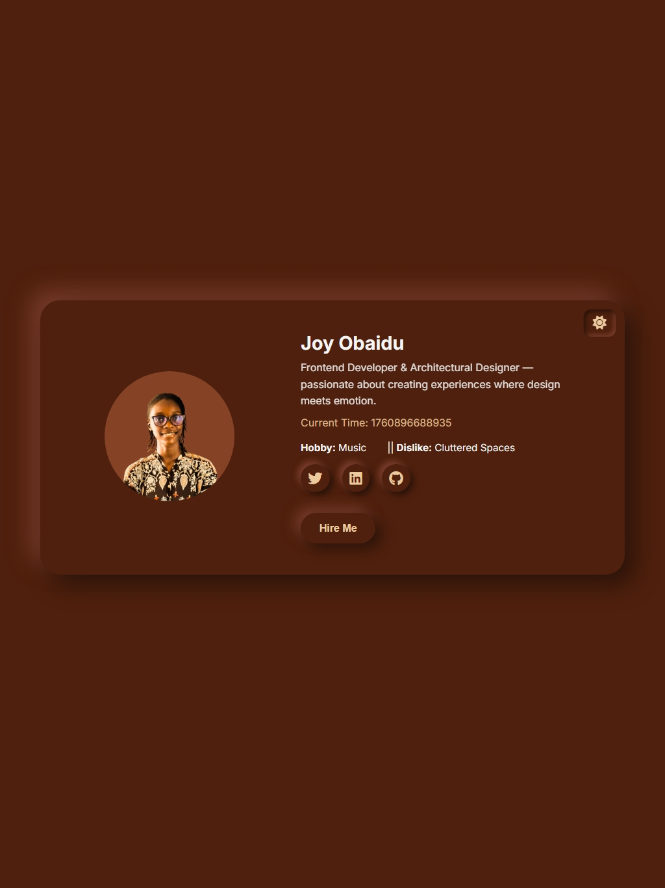
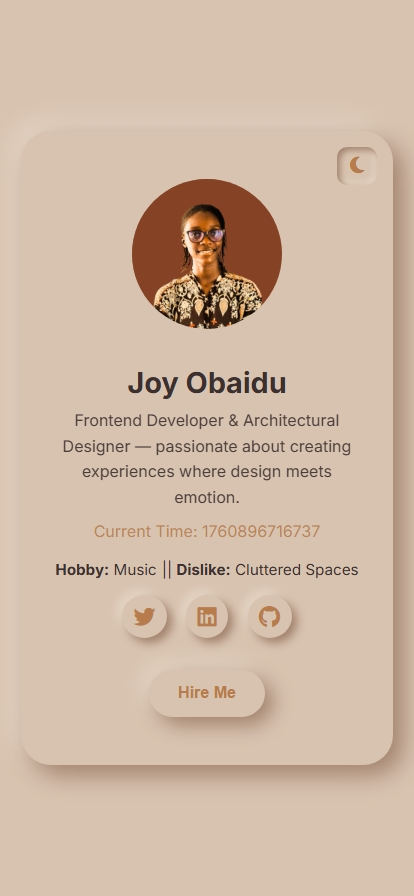
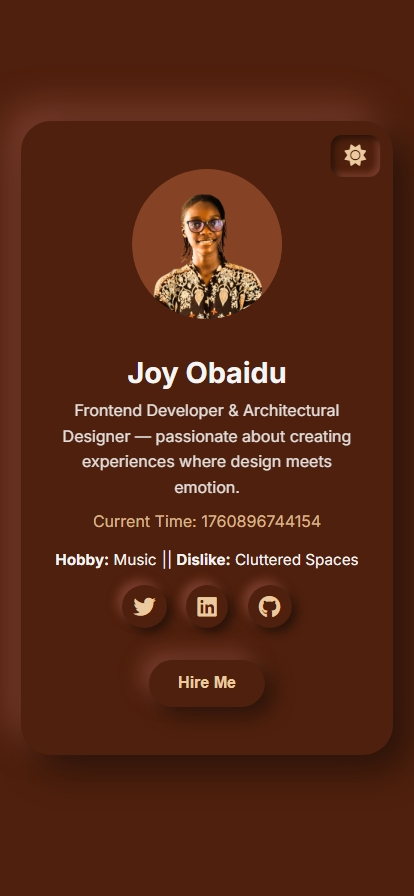

#Profile Card — Joy Obaidu

A modern, aesthetic **Neomorphism Profile Card** built with **HTML, CSS, and JavaScript**, designed to blend soft visuals with minimal interaction.  
This card showcases a personal profile with elegant neumorphic effects, brown-themed tones, dark/light mode toggle, and smooth hover animations.

---
## Live link - https://joyobaidu.github.io/Profile-Card-/
## 🪶 Features

- 🎨 **Neomorphic Design** — soft shadows and depth for a clean, 3D-like feel.  
- 🌗 **Light & Dark Theme Toggle** — switch themes seamlessly with one click.  
- ⏰ **Real-Time Clock** — displays live time with automatic updates.  
- 🖱️ **Interactive Hover Animations** — subtle scale and glow effects on hover.  
- 💼 **Social Links** — icons linking to professional profiles (LinkedIn, GitHub, Twitter).  
- 💬 **Call to Action Button** — a glowing “Hire Me” button with smooth motion.  
- 📱 **Fully Responsive** — works perfectly across mobile, tablet, and desktop.  

---

## 🧱 Built With

- **HTML5** – semantic structure  
- **CSS3** – Neomorphic UI, animations, and responsive layout  
- **JavaScript (ES6)** – theme toggling and live time updates  
- **Font Awesome** – for social media icons  
- **Google Fonts** – “Inter” and “Poppins” typography

---

## Preview
[Desktop Light mode](image.png)

---

